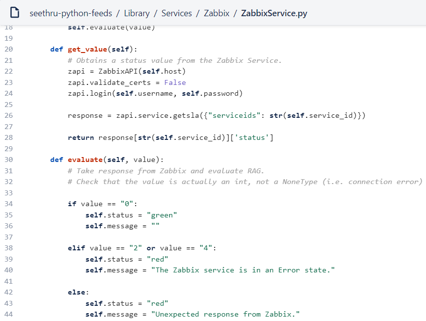
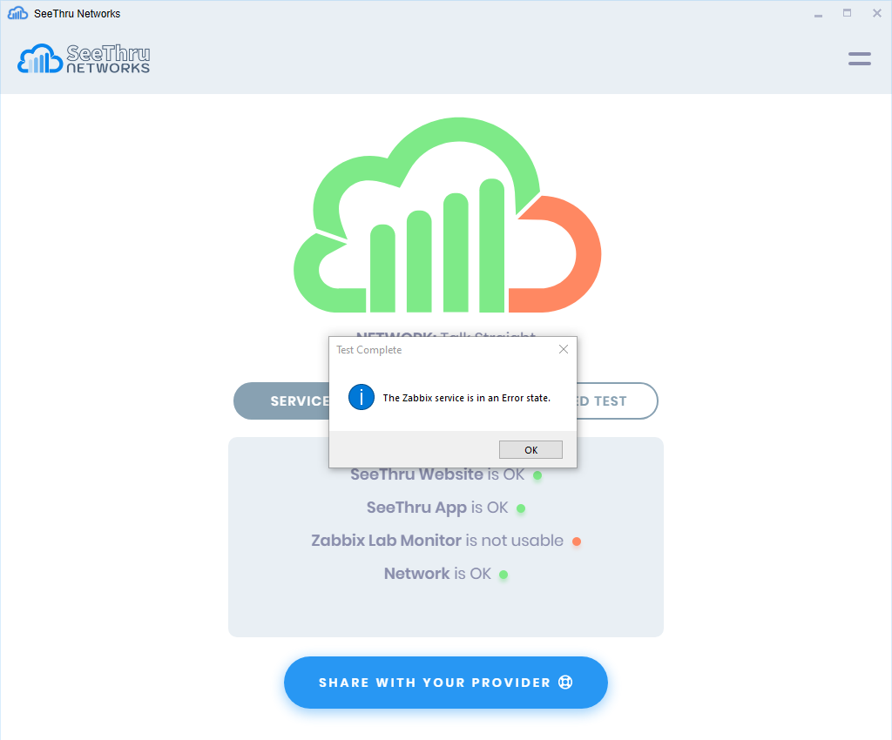

**A low cost customer visualisation solution for technology providers**

### The problem with visualising data for end users, when there isn’t any data to visualise.

As SeeThru grows we are expanding our customer base into new market segments with differing use cases. We have conversations where tech providers want to simplify the conversation with their end users — a big tick for SeeThru. But they haven't yet built management platforms that create the information for us to visualise. Yes — this is outside our happy-so-far hunting ground of ISP and IT partners where such management tools are their stock-in-trade.

### Fixing the foundations

Luckily there are a great many fantastic tools to implement network and system level monitoring. Some are open source, others have great ‘freemium’ or low cost entry points. With such a competitive, long standing market place, the top solutions are all very good. Because we were not picking sides in this fight — after a quick evaluation process we recommended our client try [Zabbix](https://www.zabbix.com "Zabbix Website") as one suitable fit for their requirement.

### The customer use case

Our customer has many customer sites each with a varied deployment of IP networking endpoints. Each solution requires the co-operation of 3rd party suppliers such as WiFi LAN providers, ISPs etc.

Enabling our customer to co-ordinate with these suppliers in front of their mutual customer is our use case.

### Testing the solution

The happy thing about Zabbix for SeeThru is its specific feature “Services”. Initially we deployed a central server and built a Zabbix proxy on the ever dependable Raspberry Pi. Putting the Pi in our lab environment we created a service “SeeThru Lab availability” with a whole bunch of suitable dependencies for the overall “ok” or “not ok” signal from Zabbix.

Once we had the service established we interacted with the very comprehensive Zabbix API to extract the “ok/not ok” status. Overall it took about an hours work our side to translate the Zabbix output to a “Red/Green” signal for the SeeThru platform to disseminate. Pulling the plug on one of our pieces of lab kit gave us the satisfying result illustrated below.

### Its getting easier to communicate service information to end users

The out of the box experience with Zabbix is no doubt repeatable with other solutions. Using these platforms it is a fairly straightforward job for a tech provider to illustrate the overall status of a service to your end users. Mashing systems together is of course the enduring appeal of APIs!

Zabbix and all terms associated with it of course are the property of that organisation.