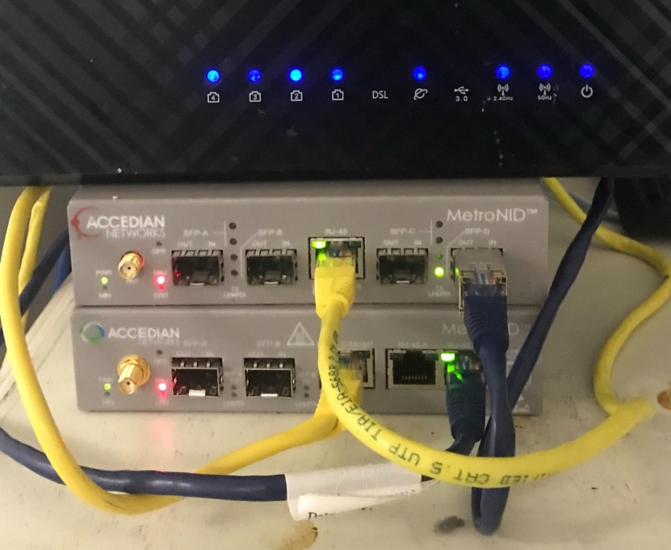
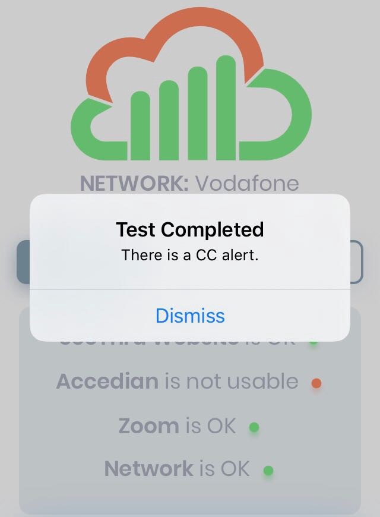

**Monitoring a Carrier Ethernet circuit and representing its live status on the SeeThru app**

Our newly created API and Python environment needed a test beyond meeting our own internal needs. Conveniently, just after we completed version one of our external feeds API, I was meeting friends in London who work at Accedian. Having some excellent Accedian Carrier Ethernet NIDs in our kit bag we hatched a plan. To test our API and have a ready explanation to my friends of “what I was up to”, we would integrate a feed from the NIDs illustrating the service status of an Ethernet circuit. Easy.

### Building an Accedian test setup


We built a back-to-back setup between two Accedian MetroNID TEs. Configuration was limited to a quick and easy L2 PAA monitoring session between the two devices. SNMP access was configured and that was it.

### Setting up the SeeThru feed
Using pysnmp it was straightforward enough to read the SNMP database object that would tell us if there was a continuity alert between the two devices. Evaluating the continuity check and labelling it appropriately “red” or “green”, we now had a simple test of our API and a nice way for me to illustrate to my friends what we were doing with the SeeThru platform.

```
# Takes an acdPaaStatusCcAlert value and evaluates RAG based on some context.
def evaluateStatusFromCcStatusValue(value):
    if (value === "1"):
        return ["red", "There is a CC alert."];
    elif (value === "2"):
        return ["green", "There is no CC alert."];
    else:
        return ["red", "Could not connect to the SNMP feed or locate a CC alert."];
```

### Running the demo
The plan being simple enough.

1. Meet friends — get them to buy coffee
2. Show SeeThru app and proudly explain how it works
3. Point out to friends the Accedian test reference.
4. Remote into lab, disable the “far end” PAA session on one of the NIDs
5. Exclaim “da dah!” as the Accedian test went Red on my phone as the Continuity Check alarmed out.

### Actual demo
1. It was late in the day — no one could take any more coffee
2. The physical environment meant that the active demo was me calling the development team and asking them to pull the cable out.
3. The demo of course worked perfectly thereafter and my friends were patiently gracious enough to say all the nice things that friends do in such circumstances.



### In conclusion
We found that the SeeThru API for extending our feeds to external monitors worked as expected.

Good friends are always there to nod patiently with wry smiles on their faces when you proudly show them your new “baby”.

Please note that this exercise was completely independent of any arrangement or involvement with Accedian. However I will point out that, in my opinion, every practising network techie would do well to have at least one Accedian MetroNID in their lab setup. They are so useful.
